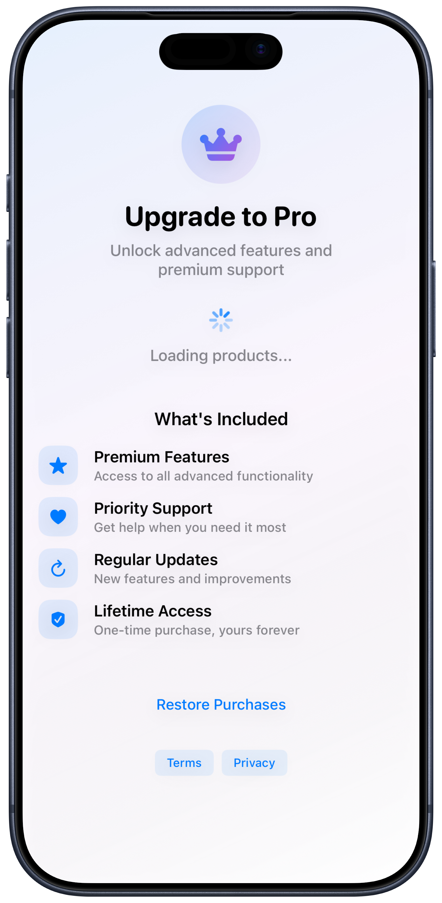
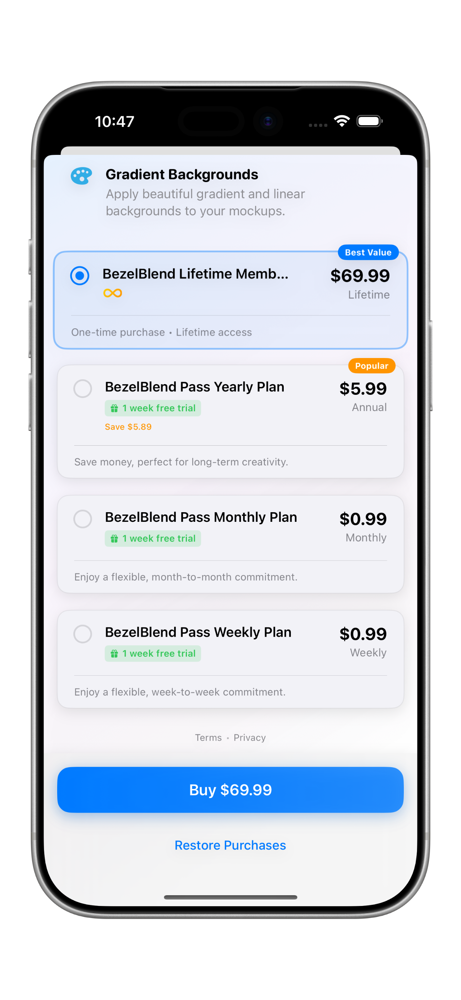

# InAppKit

> **The simplest way to add premium features to your Swift app**

Transform any SwiftUI view into a premium feature with just one line of code. InAppKit handles StoreKit complexity so you can focus on building great features.

```swift
ContentView()
    .withPurchases("com.yourapp.pro")
```

## 🎨 Visual Showcase

<div align="center">

<table>
<tr>
<td width="50%" align="center">

<br/>
<strong>🚀 Ready-to-use Paywalls</strong>
<br/>
<em>Beautiful, localized paywalls that work out of the box</em>
</td>
<td width="50%" align="center">

<br/>
<strong>💳 Smart Purchase Options</strong>
<br/>
<em>Flexible pricing cards with marketing badges and savings indicators</em>
</td>
</tr>
</table>

</div>

## ✨ What You Get

- **🚀 One-line setup** - Add premium features instantly
- **🎯 Type-safe features** - Enum-based feature gating prevents errors
- **💳 StoreKit integration** - Handles purchases, receipts, and validation
- **🎨 Customizable paywalls** - Beautiful UI out of the box, fully customizable
- **🌍 Localization support** - Built-in internationalization with fallback safety
- **📱 iOS 17+ support** - Built with latest SwiftUI and StoreKit 2

## 🚧 Requirements

- iOS 17.0+
- Xcode 15.0+
- Swift 5.9+

## 📦 Installation

### Swift Package Manager

```swift
dependencies: [
    .package(url: "https://github.com/tddworks/InAppKit.git", from: "1.0.0")
]
```

## 🚀 Quick Start

### 1. Add InAppKit to any view

```swift
import InAppKit

ContentView()
    .withPurchases("com.yourapp.pro")
```

### 2. Gate premium features

```swift
Text("Premium Content")
    .requiresPurchase()  // Shows paywall if not purchased
```

### 3. That's it!

InAppKit automatically:
- Creates and displays paywalls when needed
- Handles StoreKit purchases
- Validates receipts
- Remembers purchase state

## 📚 Learn More

### 🎓 **[Getting Started Guide](docs/getting-started.md)**
Learn core concepts: Products, Features, and Paywalls

### 💰 **[Monetization Patterns](docs/monetization-patterns.md)**
Choose the right strategy: Freemium, Premium, or Subscription

### 🎨 **[Customization Guide](docs/customization.md)**
Customize UI, add marketing info, and advanced configuration

### 🌍 **[Localization Guide](docs/localization-keys.md)**
Multi-language support with 30+ localization keys and fallback safety

### 📖 **[API Reference](docs/api-reference.md)**
Complete API documentation and advanced features

## 🎯 Real-World Example

```swift
enum AppFeature: String, AppFeature {
    case removeAds = "remove_ads"
    case cloudSync = "cloud_sync"
    case exportPDF = "export_pdf"
}

ContentView()
    .withPurchases(products: [
        Product("com.yourapp.pro", features: AppFeature.allCases)
    ])
    .withPaywall { context in
        PaywallView(products: context.availableProducts)
    }
```

## 🛠️ Support

- **Issues**: [GitHub Issues](https://github.com/tddworks/InAppKit/issues)
- **Discussions**: [GitHub Discussions](https://github.com/tddworks/InAppKit/discussions)
- **Documentation**: [docs/](docs/)

## 🤝 Contributing

We welcome contributions! Please see our [Contributing Guide](CONTRIBUTING.md) for details.

## 📄 License

Apache-2.0 License. See [LICENSE](LICENSE) for details.

---

## 🙏 Acknowledgments

- Built on Apple's StoreKit 2
- Inspired by SwiftUI's declarative approach
- Designed for modern iOS development

---

**Ready to add premium features?** → **[Start with the Getting Started Guide](docs/getting-started.md)**

<div align="center">

**InAppKit** - Because in-app purchases shouldn't be complicated. 🚀

Made with ❤️ by the [TDDWorks](https://github.com/tddworks) team

</div>
